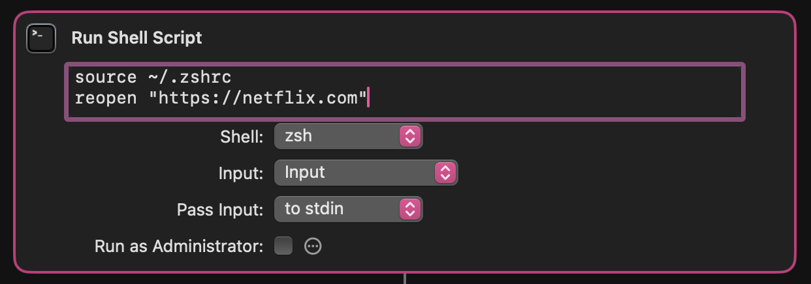

<div align="center">
<picture>
  <source media="(prefers-color-scheme: dark)" srcset="images/logo_dark.svg" width="300">
  <source media="(prefers-color-scheme: light)" srcset="images/logo_light.svg" width="300">
  
</picture>
</div>

<h3 align="center">
	Simple CLI to (re)open a specific URL. If no such tab exists, it opens a new one.
</h3>


# Open Existing URL in Browser

This project provides simple scripts to open a specific URL in an existing tab of either Google Chrome or Safari. If no such tab exists, it opens a new one.

gif

## 🚀 Installation 
```sh
brew tap lennarto/reopen
brew install reopen
```

## Usage
```sh
reopen netflix.com # standard-browser = chrome
reopen safari netflix.com # use specific browser
reopen standard safari # change standard-browser
```
#### Use RAW script without homebrew (no installation required)

```sh
osascript -l JavaScript /scripts/open-chrome-tab.js "https://web.whatsapp.com/"
```
## Browsers
#### ✅ Supported
```sh
reopen standard **chrome** 
reopen standard safari 
reopen standard edge 
reopen standard opera 
```

#### ❌ NOT Supported
Unfortunately, **Arc** and **Firefox** do not allow access to "tabs". They also have very limited AppleScript support. A solution for firefox might be possible, but needs more development effort. You can upvote the issues to show your interest.

[Arc support](issues/1)
[Firefox support](issues/2)
 
## Integration Examples
You can integrate this with Tools like Apple Shortcuts or [BetterTouchTool](https://folivora.ai/) to quickly re-open urls with specific gestures, buttons, or keyboard shortcuts.

### You might need to load your shell config first
BetterTouchTools and Shortcuts (especially in “Run Shell Script”) often run a minimal environment: they don’t load your full shell config. That’s why reopen might be unknown inside these tools, and **you might have to load your shell config before.
In my case, it works with:**
```sh
source ~/.zshrc
reopen "https://netflix.com"
```

### Need of using " " and https

In the embedded terminals, you might need to put the url in brackets and add https."
```sh
reopen netflix.com # works perfectly in normal terminals
reopen "https://netflix.com" # might be needed in embedded terminals (like Shortcuts or BetterTouchtools)
```

#### Better Touch Tools


#### Apple Shortcuts




## 🤝  Found a bug? Missing a specific feature?
Feel free to file a new issue with a respective title and description

## 💛 Support ABOUT ME / Contributing / License
sponsor page

## 📘 License
"open-existing-tab" is released under the terms of the [MIT License](LICENSE).

BUY ME a COFFE, PAYPAL, LO FI