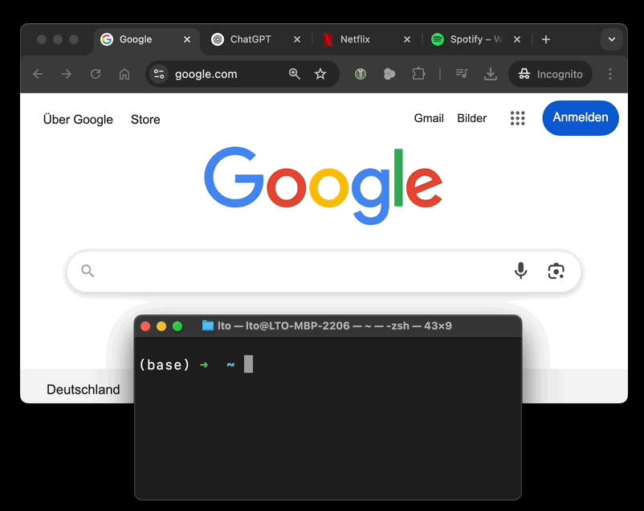

<div align="center">
<picture>
  <source media="(prefers-color-scheme: dark)" srcset="images/logo_dark.svg" width="300">
  <source media="(prefers-color-scheme: light)" srcset="images/logo_light.svg" width="300">
  
</picture>
</div>

<h3 align="center">
	Simple CLI to (re)open a specific URL. If no such tab exists, it opens a new one.
</h3>



# Open Existing URL in Browser

This project provides simple scripts to open a specific URL in an existing tab of either Google Chrome or Safari. If no such tab exists, it opens a new one.

gif

## 🚀 Installation 
```sh
brew tap lennarto/reopen
brew install reopen
```

## Usage
```sh
reopen netflix.com # standard-browser = chrome
reopen safari netflix.com # use specific browser
reopen standard safari # change standard-browser
```
#### Use RAW script without homebrew (no installation required)

```sh
osascript -l JavaScript /scripts/open-chrome-tab.js "https://web.whatsapp.com/"
```


TODO:
- more browsers to come

## Integration Example: BetterTouchTool

You can integrate this with [BetterTouchTool](https://folivora.ai/) to quickly launch or focus specific web apps using gestures or shortcuts.


## Apple Shortcuts
**todo**

## 🤝  Found a bug? Missing a specific feature?
Feel free to file a new issue with a respective title and description

## 💛 Support ABOUT ME / Contributing / License
sponsor page

## 📘 License
"open-existing-tab" is released under the terms of the [MIT License](LICENSE).

BUY ME a COFFE, PAYPAL, LO FI

BUGS
- scheint noch nicht alles zu funktionieren, zB bild.de