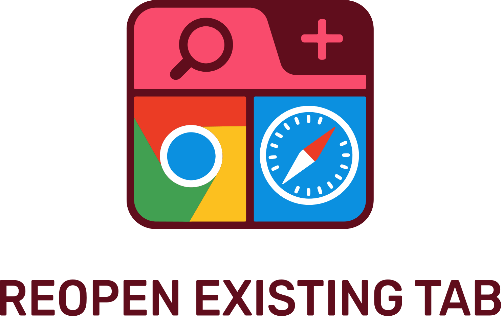
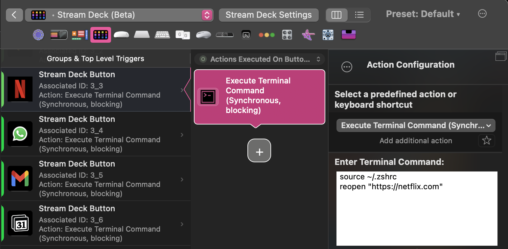

# Open Existing URL in Browser

<picture>
  <source media="(prefers-color-scheme: dark)" srcset="images/logo_dark.svg" width="200">
  <source media="(prefers-color-scheme: light)" srcset="images/logo_light.svg" width="200">
  
</picture>

This project provides simple scripts to open a specific URL in an existing tab of either Google Chrome or Safari. If no such tab exists, it opens a new one.

## Usage

### Open in Chrome

```sh
osascript -l JavaScript /users/lto/open-chrome-tab.js "https://web.whatsapp.com/"
```

### Open in Safari

```sh
osascript -l JavaScript /users/lto/open-safari-tab.js "https://web.whatsapp.com/"
```

## Integration Example: BetterTouchTool

You can integrate this with [BetterTouchTool](https://folivora.ai/) to quickly launch or focus specific web apps using gestures or shortcuts.



## Apple Shortcuts
**todo**